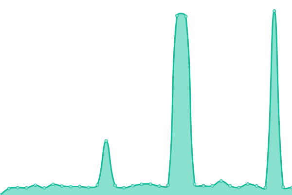
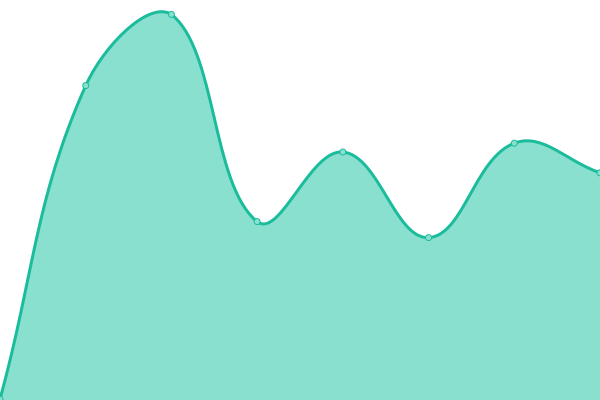

# [📈 Live Status](https://status.ssrq-sds-fds.ch): <!--live status--> **🟩 All systems operational**

This repository contains the open-source uptime monitor and status page for [Rechtsquellenstiftung des Schweizerischen Juristenvereins](www.ssrq-sds-fds.ch), powered by [Upptime](https://github.com/upptime/upptime).

With [Upptime](https://upptime.js.org), you can get your own unlimited and free uptime monitor and status page, powered entirely by a GitHub repository. We use [Issues](https://github.com/SSRQ-SDS-FDS/ssrq-uptime/issues) as incident reports, [Actions](https://github.com/SSRQ-SDS-FDS/ssrq-uptime/actions) as uptime monitors, and [Pages](https://status.ssrq-sds-fds.ch) for the status page.

<!--start: status pages-->
<!-- This summary is generated by Upptime (https://github.com/upptime/upptime) -->
<!-- Do not edit this manually, your changes will be overwritten -->
<!-- prettier-ignore -->
| URL | Status | History | Response Time | Uptime |
| --- | ------ | ------- | ------------- | ------ |
|  [SSRQ Project Website](http://ssrq-sds-fds.ch) | 🟩 Up | [ssrq-project-website.yml](https://github.com/SSRQ-SDS-FDS/ssrq-uptime/commits/HEAD/history/ssrq-project-website.yml) | 

 1484ms
     
 | 

<a href="https://status.ssrq-sds-fds.ch/history/ssrq-project-website">100.00%</a>
    

|  [Editio – the digital scholarly edition](https://editio.ssrq-online.ch) | 🟩 Up | [editio-the-digital-scholarly-edition.yml](https://github.com/SSRQ-SDS-FDS/ssrq-uptime/commits/HEAD/history/editio-the-digital-scholarly-edition.yml) | 

 2212ms
     
 | 

<a href="https://status.ssrq-sds-fds.ch/history/editio-the-digital-scholarly-edition">100.00%</a>
    

|  [IIIF Server](https://facsimiles.ssrq-sds-fds.ch/iiif/2/ADCO_BII_8_19_1r.ptif/info.json) | 🟩 Up | [iiif-server.yml](https://github.com/SSRQ-SDS-FDS/ssrq-uptime/commits/HEAD/history/iiif-server.yml) | 

 509ms
     
 | 

<a href="https://status.ssrq-sds-fds.ch/history/iiif-server">100.00%</a>
    

|  [Schema](https://schema.ssrq-sds-fds.ch/latest/) | 🟩 Up | [schema.yml](https://github.com/SSRQ-SDS-FDS/ssrq-uptime/commits/HEAD/history/schema.yml) | 

 251ms
     
 | 

<a href="https://status.ssrq-sds-fds.ch/history/schema">100.00%</a>
    

|  [SSRQ PersonsDB](https://www.ssrq-sds-fds.ch/persons-db-edit/) | 🟩 Up | [ssrq-persons-db.yml](https://github.com/SSRQ-SDS-FDS/ssrq-uptime/commits/HEAD/history/ssrq-persons-db.yml) | 

 1034ms
     
 | 

<a href="https://status.ssrq-sds-fds.ch/history/ssrq-persons-db">100.00%</a>
    

|  [SSRQ PlacesDB](https://www.ssrq-sds-fds.ch/places-db-edit/search/search-form.xq) | 🟩 Up | [ssrq-places-db.yml](https://github.com/SSRQ-SDS-FDS/ssrq-uptime/commits/HEAD/history/ssrq-places-db.yml) | 

 429ms
     
 | 

<a href="https://status.ssrq-sds-fds.ch/history/ssrq-places-db">100.00%</a>
    

|  [SSRQ LemmaDB](https://www.ssrq-sds-fds.ch/lemma-db-edit/search/search-form.xq) | 🟩 Up | [ssrq-lemma-db.yml](https://github.com/SSRQ-SDS-FDS/ssrq-uptime/commits/HEAD/history/ssrq-lemma-db.yml) | 

 698ms
     
 | 

<a href="https://status.ssrq-sds-fds.ch/history/ssrq-lemma-db">100.00%</a>
    

|  [SSRQ Index Application](https://index.ssrq-online.ch/persons/A_Z.html) | 🟩 Up | [ssrq-index-application.yml](https://github.com/SSRQ-SDS-FDS/ssrq-uptime/commits/HEAD/history/ssrq-index-application.yml) | 

 3910ms
     
 | 

<a href="https://status.ssrq-sds-fds.ch/history/ssrq-index-application">100.00%</a>
    

|  [Preview App](https://preview.ssrq-online.ch) | 🟩 Up | [preview-app.yml](https://github.com/SSRQ-SDS-FDS/ssrq-uptime/commits/HEAD/history/preview-app.yml) | 

 2603ms
     
 | 

<a href="https://status.ssrq-sds-fds.ch/history/preview-app">100.00%</a>
    

<!--end: status pages-->

[**Visit our status website →**](https://status.ssrq-sds-fds.ch)

## 📄 License

- Powered by: [Upptime](https://github.com/upptime/upptime)
- Code: [MIT](./LICENSE) © [Anand Chowdhary](https://anandchowdhary.com), supported by [Pabio](https://pabio.com)
- Data in the `./history` directory: [Open Database License](https://opendatacommons.org/licenses/odbl/1-0/)
